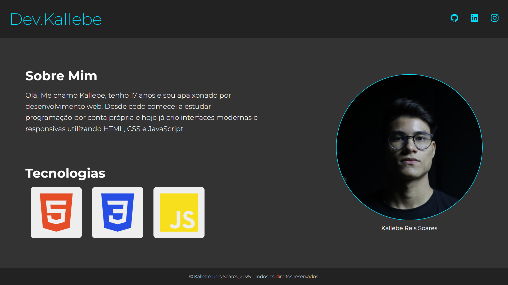

# Portfólio Pessoal - Dev.Kallebe

Este é um projeto de portfólio pessoal desenvolvido por mim. O site foi construído utilizando HTML e CSS com foco em responsividade e design limpo.

## 💻 Demonstração



## 📌 Funcionalidades

- Página única com design responsivo
- Seção “Sobre Mim” apresentando o desenvolvedor
- Ícones sociais com links para GitHub, LinkedIn e Instagram
- Destaque para tecnologias dominadas (HTML, CSS e JavaScript)
- Estrutura limpa e modular de CSS

## 🚀 Tecnologias Utilizadas

- HTML5  
- CSS3 
- Google Fonts (Montserrat)  
- Ícones do [Ionicons](https://ionic.io/ionicons)

## 🛠️ Como Executar Localmente

1. Baixe ou clone este repositório:
   ```bash
   git clone https://github.com/seu-usuario/seu-repositorio.git
Abra o arquivo index.html em qualquer navegador web moderno.

Não é necessário instalar dependências ou servidores locais — o projeto é completamente estático.

👨‍💻 Autor
Kallebe Reis
Desenvolvedor Front-End

GitHub: @kallebereis

LinkedIn: Kallebe Reis

Instagram: @kallebereis_

📄 Licença
Este projeto está licenciado sob a Licença MIT. Sinta-se livre para usá-lo como base para seus próprios projetos.

